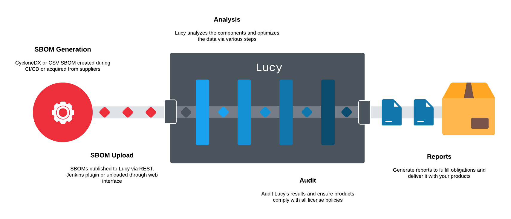

# Lucy - Licenses Under Control, Yeah!
Lucy is a component analysis platform to minimize the risk of license infringements and to support and optimize the license compliance process.

Third-party and open-source software typically has one or more licenses assigned. The chosen license may or may not allow certain types of usage, contain distribution requirements or limitations, or require specific actions if the component is modified. Lucy can identify the license(s) for a given component and provide guidance as to the nature of the license (i.e. license text, copyright, risk, source code, etc). Utilizing components with licenses which conflict with an organizations objectives or ability can create serious risk to the business.

## Features
- Track usage of components in projects
- Manage licenses with risk and requirements
- Supports standardized SPDX ID's
- Supports different uploads:
  - CycloneDX SBOM (XML)
  - CSV
  - Archives with Maven components (JAR, ZIP, WAR, etc.)
- Ecosystem agnostic with built-in repository support such as autocomplete of missing information for:
  - Maven (Java)
  - npm (Javascript)
  - PyPI (Python)
  - NuGet (.NET)
  - Golang (Go)
- Generate various reports to ensure compliant software deliveries
- Mapping for different license names
- Detects incompatible license combinations
- Supports Fossology API to start analysis of components
- Metrics for projects
- Monitor the development of projects and compare releases
- API-first design
- Local manageable users
- Runs as Docker container

## Build

## Usage

## Copyright & License
Lucy is Copyright (c) 2022 Regnology GmbH. All rights reserved.

It is licensed under [MIT](../blob/master/LICENSE).
